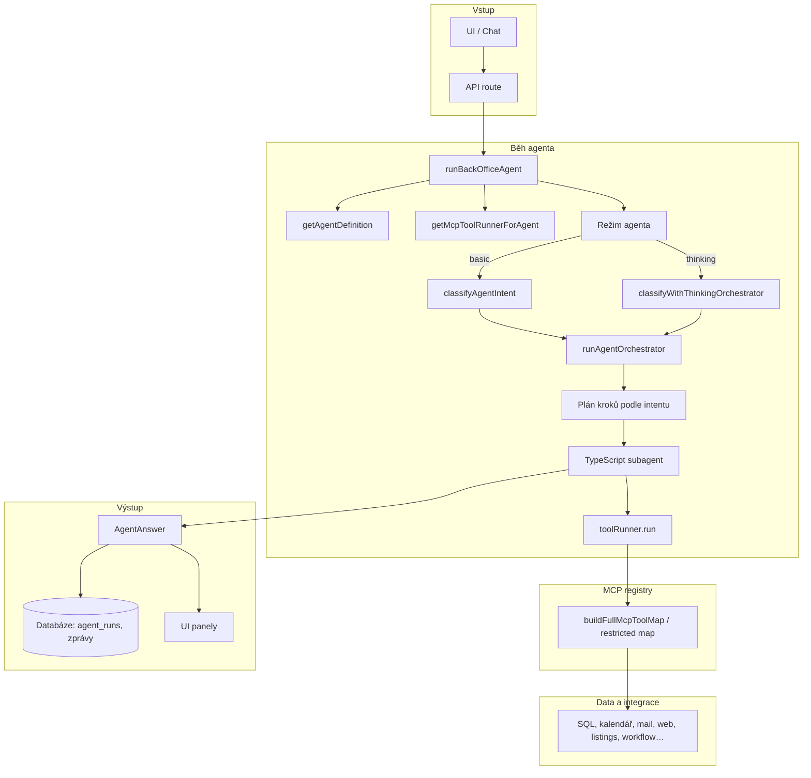
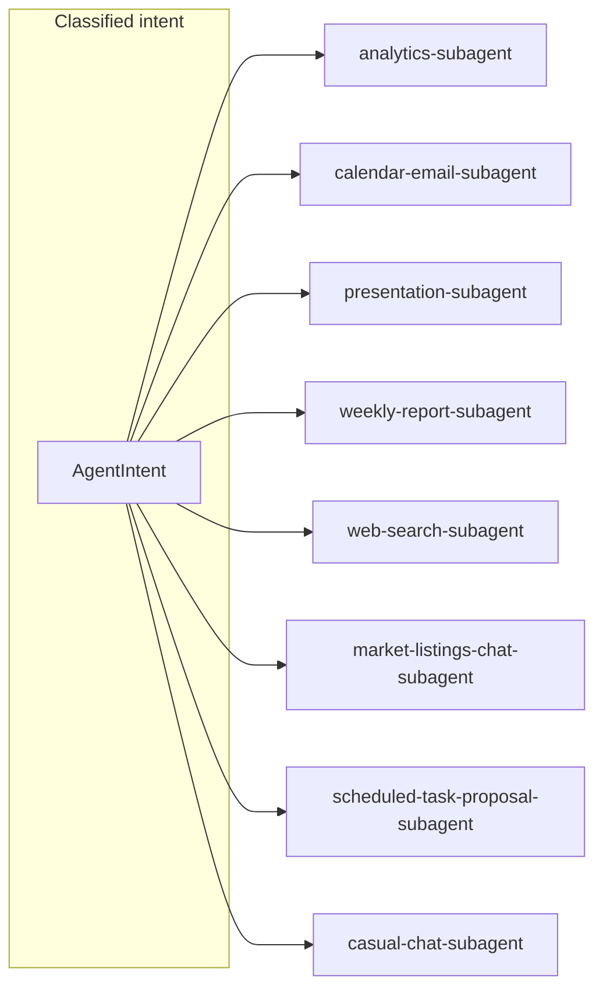
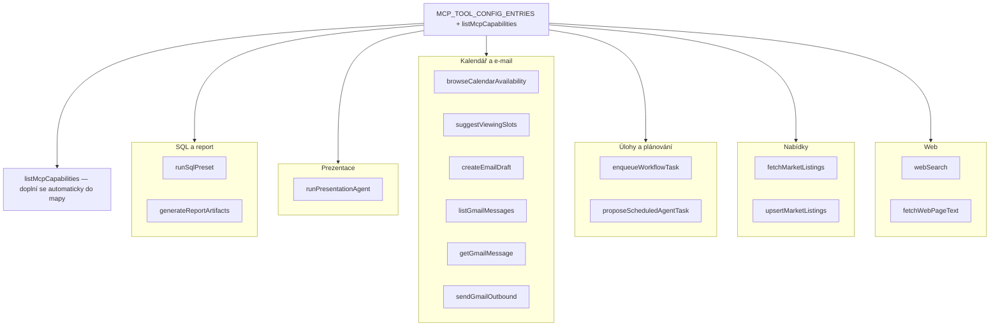
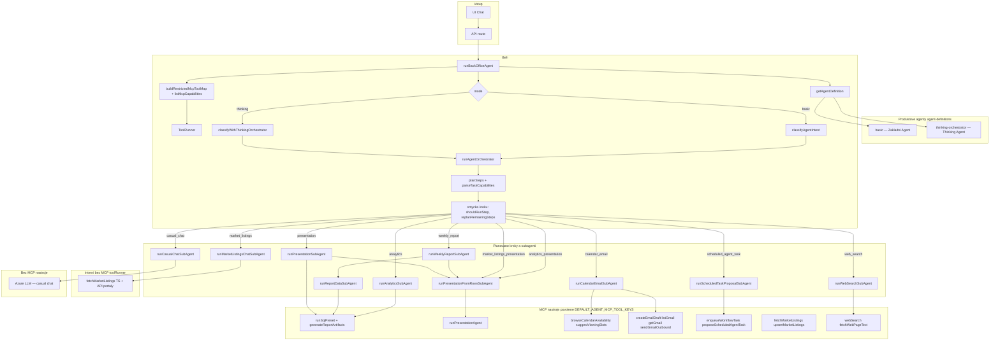

# Agentní systém — architektura (obdélníky a šipky)

Všechny diagramy jsou v Mermaidu jako **flowchart**: uzly jako obdélníky, větvení šipkami.

## 1) Hlavní tok běhu (od UI po uložení)

## 2) Intent → který subagent

## 3) MCP tooly — seskupení (stejné klíče jako v kódu)

Poznámka: `listMcpCapabilities` není v pevném seznamu `MCP_TOOL_CONFIG_ENTRIES`, do runtime mapy se přidá v `assemble-registry.ts`.

## 4) Hierarchie agentů a nástrojů (jeden přehled)

**Vrstvy:** (1) produktový profil v UI (`basic` / `thinking-orchestrator`) určuje stejnou sadu povolených MCP klíčů; (2) `runBackOfficeAgent` sestaví `ToolRunner` nad omezenou mapou + `listMcpCapabilities`; (3) klasifikace záměru; (4) `runAgentOrchestrator` naplánuje kroky (`parseTaskCapabilities` může přidat druhý krok prezentace u `analytics` / `market_listings`); (5) každý krok volá TypeScript **subagent**; subagent volá MCP přes `toolRunner.run(...)` — výjimka: `market-listings-chat-subagent` používá interní `fetchMarketListings`, nikoli MCP wrapper.

`ToolRunner` se vytvoří z profilu agenta a **předává se do každého subagentního volání** z orchestrátoru — uvnitř se volá `toolRunner.run("názevNástroje", …)`. **Bez MCP volání** zůstává `runCasualChatSubAgent` (čistě LLM). **`runMarketListingsChatSubAgent`** hlavní data bere přes interní `fetchMarketListings`, ne přes MCP klíč `fetchMarketListings` (i když je v allowlistu pro jiné účely).

**Zkratky chování orchestrátoru:** u `market_listings` + „chci prezentaci“ jsou kroky `market_listings` → `market_listings_presentation`; u `analytics` analogicky `analytics` → `analytics_presentation`. Pokud první krok nevrátí řádky pro deck, druhý krok se přeskočí (`replanRemainingSteps`). `weekly_report` uvnitř jednoho běhu skládá report (`runReportDataSubAgent`) a pak `runPresentationFromRowsSubAgent` oba přes sdílené MCP nástroje výše.
